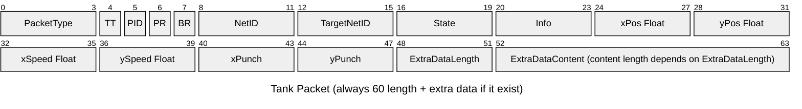

# Tank Packet

```mermaid
---
title: "Tank Packet (always 60 length + extra data if it exist)"
---
packet
+4: "PacketType"
+1: "TT"
+1: "PID"
+1: "PR"
+1: "BR"
+4: "NetID"
+4: "TargetNetID"
+4: "State"
+4: "Info"
+4: "xPos Float"
+4: "yPos Float"
+4: "xSpeed Float"
+4: "ySpeed Float"
+4: "xPunch"
+4: "yPunch"
+4: "ExtraDataLength"
+12: "ExtraDataContent (content length depends on ExtraDataLength)"
```