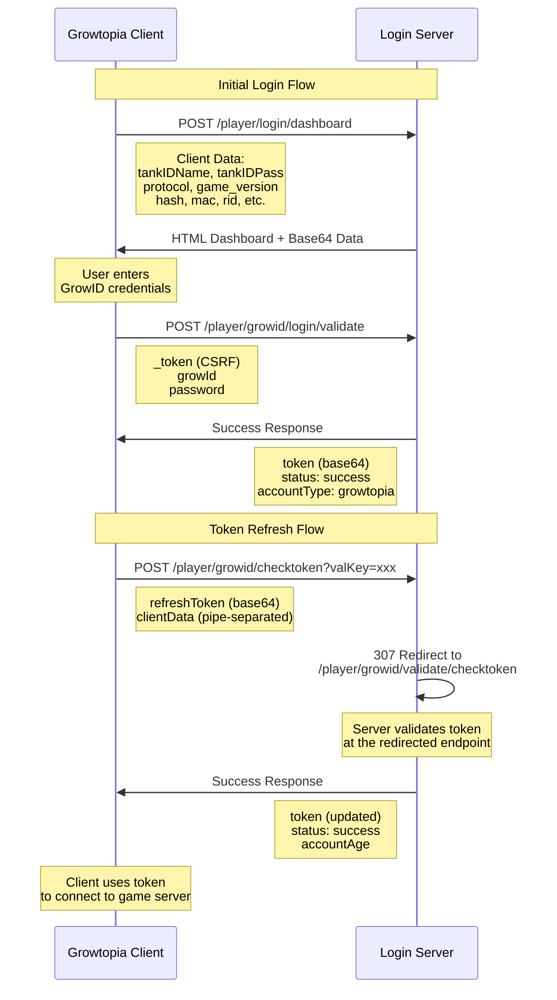

# Login Server

The login server handles authentication for Growtopia clients. It provides endpoints for validating GrowID credentials, managing tokens, and serving the login dashboard interface.





## SSL Certificate Requirements

::: warning Important
The login server **must** use a valid SSL certificate signed by a trusted Certificate Authority (e.g., Let's Encrypt). Self-signed certificates will not work by default.
:::

### Why Valid SSL is Required

Growtopia clients verify SSL certificates to prevent man-in-the-middle attacks. If the certificate is not trusted by the system, the client will reject the connection.

## Self-Signed Certificate Workaround

While not recommended for production, you can use self-signed certificates for development by trusting them on your local machine.

### Using mkcert

[mkcert](https://github.com/FiloSottile/mkcert) creates locally-trusted development certificates:

```bash
# Install mkcert
# For Windows: choco install mkcert
# For macOS: brew install mkcert
# For Linux: see mkcert documentation

# Install local CA
mkcert -install

# Generate certificate
# Specify your own domain for testing
mkcert localhost growserver.app
```

### Using Caddy

[Caddy](https://caddyserver.com/) can automatically manage certificates and act as a reverse proxy:

```caddy
# HTTP configuration - proxies to the main app
http://:80 {
    reverse_proxy localhost:3000 {
        header_up Upgrade {http.request.header.Upgrade}
        header_up Connection {http.request.header.Connection}
        header_up Host {http.request.host}
    }
}

# HTTPS for localhost and www.growtopia1.com (uses custom certificate for Growtopia login)
https://localhost:443, https://www.growtopia1.com:443 {
    tls apps/logon/assets/ssl/server.crt apps/logon/assets/ssl/server.key

    handle /growtopia/server_data.php {
        reverse_proxy localhost:3001 {
            header_up Upgrade {http.request.header.Upgrade}
            header_up Connection {http.request.header.Connection}
            header_up Host {http.request.host}
        }
    }

    handle {
        respond 404
    }
}

# Domain-specific configuration for growserver.app using automatic local HTTPS
# Change this if you own a specific domain
growserver.app {
    # Please comment this if you using actual domain
    tls internal

    reverse_proxy localhost:4321 {
        header_up Upgrade {http.request.header.Upgrade}
        header_up Connection {http.request.header.Connection}
        header_up Host {http.request.host}
    }
}

# HTTP to HTTPS redirect for growserver.app
http://growserver.app {
    redir https://growserver.app{uri} permanent
}
```

### Hosts file
```hosts
127.0.0.1 www.growtopia1.com
127.0.0.1 www.growtopia2.com
127.0.0.1 growserver.app
```


## Login Flow

The login process involves several endpoints:

### 1. Dashboard Endpoint

**Endpoint:** `POST /player/login/dashboard`

Serves the login HTML page with embedded client data.

**Request Body Format:**

The body is sent as `application/x-www-form-urlencoded` with pipe-separated key-value pairs:

```
tankIDName|username
tankIDPass|
requestedName|
f|1
protocol|225
game_version|5.4
fz|22889144
cbits|1024
player_age|25
GDPR|1
FCMToken|
category|_-5100
totalPlaytime|0
klv|client_key
hash2|-1825613599
meta|metadata
fhash|
rid|
platformID|0,1,1
deviceVersion|0
country|us
hash|-1819361137
mac|mac_address
wk|
zf|
```

**Client Data Fields:**

| Field | Description |
|-------|-------------|
| `requestedName` | Guest name |
| `tankIDName` | GrowID name |
| `tankIDPass` | GrowID password |
| `f` | Swear filter flag |
| `protocol` | Protocol version (e.g., 225) |
| `ltoken` | Base64 string that contains login data |
| `game_version` | Game version (e.g., 5.4) |
| `fz` | Game file size |
| `lmode` | Login mode: `0` = login normally, `1` = login without logging message, `2` = login with auto-enter to world (from `OnSendToServer`) |
| `cbits` | Client bits/flags. Flags: `2` = no_friend_add, `4` = hide_signs, `8` = hide_iap, `16` = hide_tapjoy (auto-added if age < 12), `32` = broadcasts, `64` = no_guild_add, `128` = no_guild_flag, `256` = disable_billboard, `512` = use_store_classic. Saved to `save.dat` as `"Client"` |
| `player_age` | Account age in days |
| `GDPR` | GDPR compliance: `1` = age over 12, `2` = country is US (en_US, en_us, US, USA), `3` = non-US country. Set after accepting terms/EULA, may come from `OnOverrideGDPRServer` |
| `FCMToken` | Firebase Cloud Messaging token (for push notifications) |
| `category` | Unknown category identifier |
| `totalPlaytime` | Total playtime in seconds |
| `gid` | Ubisoft account/global ID (Android only) |
| `klv` | Client key/license value |
| `hash2` | MAC hash |
| `meta` | Metadata from `server_data.php` |
| `fhash` | Hash of all login info fields (without values), excluding `zf`, `UUIDToken`, and `tr` |
| `rid` | Random identifier generated once if not in `save.dat`, length 30-34 characters, saved to `save.dat` as `"rid"` |
| `platformID` | Platform identifier: `0` = Windows, format: `OS,version,subversion` |
| `deviceVersion` | Operating system version |
| `country` | Country code (2-letter ISO) |
| `hash` | Device ID hash |
| `mac` | MAC address |
| `user` | User data from `OnSendToServer` |
| `token` | Token from `OnSendToServer` |
| `UUIDToken` | UUID token from `OnSendToServer` |
| `wk` | Cryptography info from Windows registry: `HKEY_LOCAL_MACHINE\SOFTWARE\Microsoft\Cryptography` and `HKEY_CURRENT_USER\Software\Microsoft\29549`. Returns `NONE0` if `MachineGuid` not found, `NONE1` if `29549\*` not found, `NONE2` for other errors. Android always returns `NONE0` |
| `zf` | Binary data hash (Windows only) |
| `aid` | Advertising ID |
| `tr` | Tree support flag: `0` if root APK detected, `4322` otherwise (Android only) |
| `vid` | Not used / deprecated |
| `ProductId` | Not used / deprecated (note: without pipe separator) |
| `doorID` | Door ID from `OnSendToServer` |

**Response:** HTML page with embedded client data (base64 encoded JSON)

### 2. Validate Login

**Endpoint:** `POST /player/growid/login/validate`

Validates GrowID credentials and returns an authentication token.

**Content-Type:** `application/x-www-form-urlencoded`

**Request Body:**
```json
{
  "_token": "csrf_token",
  "growId": "username",
  "password": "password"
  // More fields (Optional)
}
```


**Request Fields:**

| Field | Type | Required | Description |
|-------|------|----------|-------------|
| `_token` | string | Yes | CSRF token from the dashboard page |
| `growId` | string | Yes | GrowID username |
| `password` | string | Yes | Account password |

**Content-Type:** `text/html`

**Response (Success):**
```json
{
  "status": "success",
  "message": "Account Validated.",
  "token": "base64_encoded_token", // You could use other than encoded base64 token, such as JWT
  "url": "",
  "accountType": "growtopia"
}
```

**Response Fields:**

| Field | Type | Description |
|-------|------|-------------|
| `status` | string | Result status (`success` or `error`) |
| `message` | string | Human-readable status message |
| `token` | string | Base64-encoded authentication token containing `_token`, `growId`, `password`, and `reg` fields |
| `url` | string | Redirect URL (usually empty) |
| `accountType` | string | Account type (always `growtopia`) |

**Response (Error):**
```json
{
  "status": "error",
  "message": "Invalid credentials."
}
```

### 3. Check Token

**Endpoint:** `POST /player/growid/checktoken?valKey=...`

**Note:** This endpoint uses a 307 (Temporary Redirect) to redirect requests to `/player/growid/validate/checktoken`. The client first calls `/player/growid/checktoken`, which the server redirects to the validation endpoint. Without this redirect, the login page will not complete and will get stuck.

**Redirect Configuration:**
```json
redirects: {
  "/player/growid/checktoken": {
    status: 307,
    destination: "/player/growid/validate/checktoken"
  }
}
```

Validates the refresh token and returns an updated authentication token.

**Query Parameters:**

| Parameter | Description |
|-----------|-------------|
| `valKey` | Validation key (optional security token) |

**Request Headers:**
```yaml
:method: POST
:authority: login.growtopiagame.com
:path: /player/growid/checktoken?valKey=validation_key
:scheme: https
content-length: 1151
cache-control: max-age=0
sec-ch-ua: "Not(A:Brand";v="8", "Chromium";v="144", "Microsoft Edge";v="144", "Microsoft Edge WebView2";v="144"
sec-ch-ua-mobile: ?0
sec-ch-ua-platform: "Windows"
content-type: application/x-www-form-urlencoded
upgrade-insecure-requests: 1
user-agent: Mozilla/5.0 (Windows NT 10.0; Win64; x64) AppleWebKit/537.36 (KHTML, like Gecko) Chrome/144.0.0.0 Safari/537.36 Edg/144.0.0.0
origin: null
accept: text/html,application/xhtml+xml,application/xml;q=0.9,image/avif,image/webp,image/apng,*/*;q=0.8,application/signed-exchange;v=b3;q=0.7
sec-fetch-site: none
sec-fetch-mode: navigate
sec-fetch-user: ?1
sec-fetch-dest: document
accept-encoding: gzip, deflate, br, zstd
accept-language: en-US,en;q=0.9
cookie: AWSALBTG=...; AWSALBTGCORS=...; AWSALB=...; AWSALBCORS=...; XSRF-TOKEN=...
priority: u=0, i
```

**Request Body Format:**

```
refreshToken=base64_encoded_refresh_token

clientData=
tankIDName|username
tankIDPass|
requestedName|
f|1
protocol|225
game_version|5.4
fz|22889144
cbits|1024
player_age|25
GDPR|1
FCMToken|
category|_-5100
totalPlaytime|0
klv|
hash2|-1825613599
meta|metadata
fhash|
rid|device_identifier
platformID|0,1,1
deviceVersion|0
country|us
hash|-1819361137
mac|mac_address
wk|
zf|
```

**Body Fields:**

| Field | Description |
|-------|-------------|
| `refreshToken` | Base64-encoded refresh token from previous login |
| `clientData` | Pipe-separated client information (same format as dashboard) |

**Content-Type:** `text/html`

**Response (Success):**
```json
{
  "status": "success",
  "message": "Account Validated.",
  "token": "new_base64_encoded_token",
  "url": "",
  "accountType": "growtopia",
  "accountAge": 0
}
```

**Response Fields:**

| Field | Type | Description |
|-------|------|-------------|
| `status` | string | Result status (`success` or `error`) |
| `message` | string | Human-readable status message |
| `token` | string | Updated base64-encoded authentication token |
| `url` | string | Redirect URL (usually empty) |
| `accountType` | string | Account type (`growtopia`) |
| `accountAge` | number | Account age in days |

**Response (Error):**
```json
{
  "status": "error",
  "message": "Invalid or expired token."
}
```
